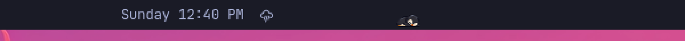
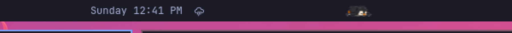
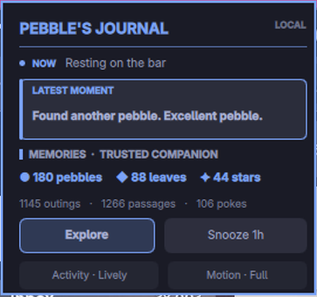

# Pebble

A quiet, expressive penguin who inhabits the Omarchy bar.

Pebble is the only companion currently shipped by this plugin. He is designed
to feel like a tiny animal sharing the bar rather than a widget displaying one:
curious, slightly clumsy, calm when ignored, and entirely local.

## What Pebble does

- Wanders the full horizontal bar, including behind the center clock widgets.
- Sleeps, stretches, preens, slips, belly-slides, and occasionally gets curious.
- Finds leaves, pebbles, and stars, then carries them home to remember.
- Remembers recent special activities locally so it can vary what happens next.
- Responds to hover, clicks, a split Journal / Care panel, and a one-hour snooze.
- Offers Quiet, Normal, Lively, Reduced Motion, and optional Curious cursor modes.
- Adapts to the active monitor and pauses safely when the bar is hidden.
- Uses no network, analytics, global desktop input monitoring, or cloud account.

## Interaction

- Hover Pebble for a hand cursor and a small stir or look.
- When Pebble is sleeping, left-click him to wake him — or bring the pointer near him on the bar with Curious on.
- While Pebble is awake, left-click him for hops, slides, slips, and other small antics (chains still unlock belly slide / clock hide).
- Right-click Pebble—sleeping or awake—to open the local **PEBBLE** panel: latest moment, Explore / Go home, Snooze, Energy, Curious, and Calm motion.
- Middle-click Pebble to send him walking home.
- **Curious** is on by default (bar-local only; turn off anytime) so Pebble may look, scoot, chase, or flee **only while the pointer travels along the bar**.
- Use **Snooze 1h** to pause autonomous outings; left-click Pebble to wake him early.
- Use **Calm motion** to suppress dramatic autonomous antics and continuous breathing animation.

## See Pebble in motion

These demos are rendered from the same runtime-ordered frames shipped in the
plugin. They are intentionally enlarged so the transitions and silhouette are
easy to inspect on GitHub.

| Waddle and return | Tucked sleep |
|---|---|
|  |  |

| Belly slide | Slip and recover |
|---|---|
|  |  |

### On a real bar

| At home | Slip | Journal |
|---|---|---|
|  |  |  |

The complete frame sheet is available at
[`docs/media/pebble-animation-sheet.png`](docs/media/pebble-animation-sheet.png).
Regenerate the review reels with:

```sh
tools/render-animation-reels.sh /tmp/pebble-animation-reels
```

Journal state is stored at
`~/.local/state/omarchy/pebble/state.json`. It never leaves the machine.

The panel shows status, latest moment, bond/collections, and care controls in one
card — no nested pages.

On a new installation, Pebble's first journal note explains that it explores the
entire bar, rests near the center widgets, and remembers discoveries. There is no
forced tutorial popup.

## Compatibility

- Omarchy shell with panel plugin support
- Horizontal bars at the top or bottom of the display
- One active Pebble instance on the currently focused monitor

Pebble intentionally stays dormant on vertical bars. Multi-monitor placement
uses Omarchy's per-window screen information; the current release has been
implemented against that API but physically exercised on a single-monitor
system. See [`docs/COMPATIBILITY.md`](docs/COMPATIBILITY.md) for the explicit
physical test matrix.

## Install

```sh
omarchy plugin add https://github.com/thecdrz/omarchy-pebble.git --enable
```

## Remove

```sh
omarchy plugin remove io.github.thecdrz.pebble
```

Removal intentionally leaves the private journal in
`~/.local/state/omarchy/pebble/state.json`, allowing a later reinstall
to resume. Delete that file separately only when you also want to reset Pebble.

Back up or reset state explicitly:

```sh
cp ~/.local/state/omarchy/pebble/state.json ~/pebble-state-backup.json
rm ~/.local/state/omarchy/pebble/state.json
```

Pebble's complete data contract is documented in [`PRIVACY.md`](PRIVACY.md),
and artwork provenance is recorded in [`ASSET_LICENSES.md`](ASSET_LICENSES.md).

## License

MIT
