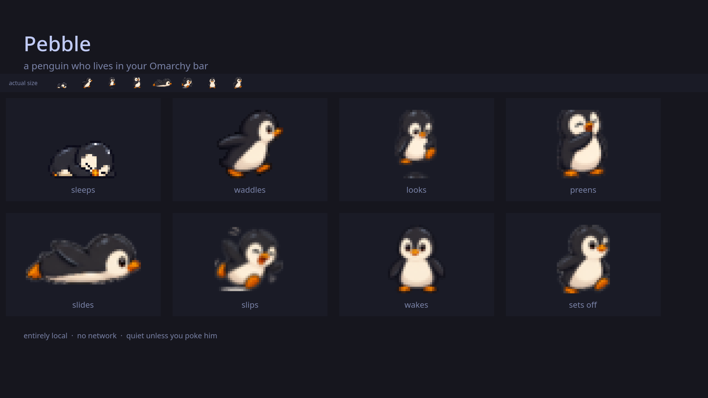
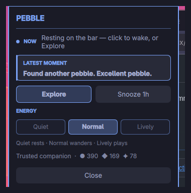
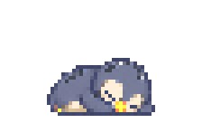
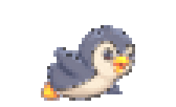

# Pebble

A quiet penguin who lives in your Omarchy bar.

Curious, slightly clumsy, calm when ignored, and entirely local. He is the only
companion this plugin ships.



## Install

```sh
omarchy plugin add https://github.com/thecdrz/omarchy-pebble.git --enable
```

## What Pebble does

- Wanders the full horizontal bar, including behind the center clock.
- Sleeps, stretches, preens, slips, and belly-slides.
- Finds leaves, pebbles, and stars, then keeps them by the nest.
- Quiet, Normal, and Lively energy, plus Calm motion.
- No network, analytics, global input monitoring, or cloud account.

## Interaction

- Hover him for a hand cursor and a small stir or look.
- Left-click to wake him, then for hops and other small antics.
- Right-click for the local **PEBBLE** panel.
- Middle-click to send him walking home.
- **Snooze 1h** pauses outings; left-click wakes him early.

Defaults are **Normal** energy, **Full** motion, **Curious on**. Quiet looks
without chasing. Lively may chase, flee, or wake from the nest. Circus stunts
stay Lively and never run under Calm.

## Care



Status, latest moment, bond, collections, and energy controls in one card. State
stays in `~/.local/state/omarchy/pebble/state.json` and never leaves the machine.

## See the animation

Studio reels from the same frames the plugin uses, enlarged for GitHub:

| Waddle and return | Tucked sleep |
|---|---|
|  |  |

| Belly slide | Slip and recover |
|---|---|
|  |  |

Full frame sheet: [`docs/media/pebble-animation-sheet.png`](docs/media/pebble-animation-sheet.png).

## Compatibility

Horizontal top or bottom bars. Intentionally dormant on vertical bars. One
Pebble on the focused monitor. See [`docs/COMPATIBILITY.md`](docs/COMPATIBILITY.md).

## Remove

```sh
omarchy plugin remove io.github.thecdrz.pebble
```

Removal leaves the private journal in place so a later reinstall can resume.
Delete `~/.local/state/omarchy/pebble/state.json` only when you also want to
reset him.

```sh
cp ~/.local/state/omarchy/pebble/state.json ~/pebble-state-backup.json
rm ~/.local/state/omarchy/pebble/state.json
```

Data contract: [`PRIVACY.md`](PRIVACY.md). Artwork: [`ASSET_LICENSES.md`](ASSET_LICENSES.md).
Forward plan: [`docs/ROADMAP.md`](docs/ROADMAP.md). Listing assets:
[`docs/MARKETPLACE.md`](docs/MARKETPLACE.md).

## License

MIT
